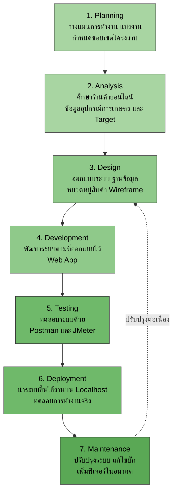

#  Farmart - Online Agricultural Equipment Store System

ระบบจัดการร้านค้าจำหน่ายอุปกรณ์การเกษตร (Online Agricultural Equipment Store System)

รายวิชา CSI204 ดิจิทัลแพลตฟอร์มสำหรับพัฒนาซอฟต์แวร์
ภาคการศึกษา 3 (Summer) ปีการศึกษา 2568

---

## 📋 สารบัญ (Table of Contents)

- [เกี่ยวกับโครงงาน](#-เกี่ยวกับโครงงาน-about)
- [หลักการและเหตุผล](#-หลักการและเหตุผล-rationale)
- [วัตถุประสงค์](#-วัตถุประสงค์-objectives)
- [ขอบเขตของระบบ](#-ขอบเขตของระบบ-system-scope)
- [เครื่องมือและเทคโนโลยีที่ใช้](#-เครื่องมือและเทคโนโลยีที่ใช้-tools--technologies)
- [แนวทางการพัฒนา (SDLC)](#-แนวทางการพัฒนา-sdlc)
- [แผนการดำเนินงาน](#-แผนการดำเนินงาน-work-plan)
- [ผลลัพธ์ที่คาดว่าจะได้รับ](#-ผลลัพธ์ที่คาดว่าจะได้รับ-expected-outcomes)
- [ทีมผู้พัฒนา](#-ทีมผู้พัฒนา-team-members)
- [วิธีติดตั้งและใช้งาน](#-วิธีติดตั้งและใช้งาน-installation)

---

## 📖 เกี่ยวกับโครงงาน (About)

**ชื่อโครงงาน (ไทย):** ระบบจัดการร้านค้าจำหน่ายอุปกรณ์การเกษตร
**ชื่อโครงงาน (อังกฤษ):** Online Agricultural Equipment Store System
**Domain:** eCommerce

---

## 💡 หลักการและเหตุผล (Rationale)

ปัจจุบันร้านจำหน่ายอุปกรณ์การเกษตรมีการจัดการข้อมูลสินค้า การขาย และสต๊อกสินค้าโดยใช้การจดบันทึกหรือโปรแกรมพื้นฐาน ส่งผลให้เกิดความผิดพลาดในการตรวจสอบสินค้า การคำนวณยอดขาย และการติดตามสินค้าคงคลัง ดังนั้นจึงพัฒนาระบบจัดการร้านค้าจำหน่ายอุปกรณ์การเกษตรขึ้นเพื่อเพิ่มประสิทธิภาพในการบริหารจัดการสินค้า การขาย และการออกรายงานต่าง ๆ ให้มีความถูกต้อง รวดเร็ว และสะดวกมากยิ่งขึ้น

---

## 🎯 วัตถุประสงค์ (Objectives)

1. เพื่อพัฒนาระบบร้านค้าออนไลน์ที่ช่วยให้ผู้ใช้งานสามารถเลือกซื้อสินค้าและสั่งซื้อสินค้าได้อย่างสะดวกผ่านเว็บไซต์
2. เพื่อจัดการข้อมูลสินค้า คำสั่งซื้อ และข้อมูลลูกค้าให้อยู่ในรูปแบบดิจิทัล ลดความซับซ้อนในการบริหารจัดการ
3. เพื่อเพิ่มประสิทธิภาพและความรวดเร็วในการซื้อขายสินค้า รวมถึงอำนวยความสะดวกในการติดตามสถานะคำสั่งซื้อ

---

## 🧭 ขอบเขตของระบบ (System Scope)

### ผู้ใช้งาน (Actors)
- ✅ ลูกค้า (Customer)
- ✅ พนักงาน (Employee) — ผู้ดูแลสต๊อกสินค้า
- ✅ ผู้ดูแลระบบ (Administrator)

### ความสามารถหลักของระบบ (Main Functions)
1. **จัดการข้อมูลสินค้า** — เพิ่ม/แก้ไข/ลบ, ค้นหา, รายละเอียดสินค้า, หมวดหมู่สินค้า
2. **จัดการสต๊อกสินค้า** — เพิ่มสินค้า, ตัดสต๊อก, แจ้งเตือนสินค้าใกล้หมด
3. **ระบบขายสินค้า** — เลือกซื้อสินค้า, คำนวณราคา, บันทึกการขาย
4. **จัดการข้อมูลลูกค้า** — เพิ่ม/แก้ไขข้อมูลลูกค้า, ดูประวัติการสั่งซื้อ
5. **รายงานและสรุปผล** — แดชบอร์ดยอดขาย, สินค้าคงเหลือ, สินค้าขายดี

---

## 🛠 เครื่องมือและเทคโนโลยีที่ใช้ (Tools & Technologies)

### Frontend
- HTML / CSS / JavaScript
- React
- Tailwind CSS

### Backend
- Node.js
- Express.js

### Database
- Local Storage

### Design Tool
- Figma
- Stitch AI

### Version Control
- Git
- GitHub

### Testing
- Postman
- JMeter
- Manual Testing / User Acceptance Testing (UAT)

---

## 🔄 แนวทางการพัฒนา (SDLC)

โครงงานนี้ใช้แนวทางการพัฒนาระบบแบบ **SDLC (System Development Life Cycle)** ทั้ง 7 ขั้นตอน



---

## 📅 แผนการดำเนินงาน (Work Plan: 4 Weeks)

| สัปดาห์ | กิจกรรม | รายละเอียด | SDLC Phase |
|:---:|---|---|---|
| **1** | วิเคราะห์และออกแบบระบบ (Analysis & Design) | ออกแบบ SDLC, Use Case, Database Design, ออกแบบ UX/UI ด้วย Figma และ Stitch AI → ทำโดย ภัทรนันท์, กองทัพ | Analysis + Design |
| **2** | พัฒนา Frontend | พัฒนา Frontend ด้วย React.js และ JavaScript ตาม Figma เชื่อมต่อ API และทำ Responsive UI → ทำโดย ปฏิภาณ, พงศกร, กองทัพ | Development |
| **3** | พัฒนา Backend และฐานข้อมูล | สร้าง API ประมวลผล server ด้วย Node.js และ Postman เช็คเป็นระยะ → ทำโดย ศิววงศ์, ปฏิภาณ, ภัทรนันท์ | Development |
| **4** | ทดสอบระบบและนำเสนอ | Test ทดสอบระบบด้วย Postman, Load Testing ด้วย JMeter, ทดสอบ UAT → ทำโดย ภัทรนันท์ | Testing |

---

## ✅ ผลลัพธ์ที่คาดว่าจะได้รับ (Expected Outcomes)

1. ได้ระบบจัดการร้านค้าจำหน่ายอุปกรณ์การเกษตรที่สามารถจัดการข้อมูลสินค้าได้
2. สามารถบันทึก ติดตาม และจัดการข้อมูลการขายสินค้าได้อย่างถูกต้องรวดเร็ว
3. ช่วยลดความผิดพลาดในการจัดเก็บข้อมูลสินค้า คลังสินค้า และรายการขาย
4. เพิ่มประสิทธิภาพในการบริหารจัดการร้านค้าและอำนวยความสะดวกแก่ผู้ใช้งาน

---

## 👥 ทีมผู้พัฒนา (Team Members)

**ชื่อกลุ่ม:** เทอมนี้ต้องรอด

| ลำดับ | รหัสนักศึกษา | ชื่อ-สกุล | หน้าที่รับผิดชอบ |
|:---:|:---:|---|---|
| 1 | 67114610 | กองทัพ โคกอาศัย | UX/UI, Frontend Dev |
| 2 | 67118401 | ปฏิภาณ ฉิมจีน | Frontend Dev, Backend Dev |
| 3 | 67122203 | ศิววงศ์ เตยโพธิ์ | Database, Backend Dev |
| 4 | 67162470 | พงศกร ศรีนวลนุ่ม | Frontend Dev |
| 5 | 67178847 | ภัทรนันท์ สิงห์เชิดชู | PM, Full-stack, QA |

---

## 🚀 วิธีติดตั้งและใช้งาน (Installation)

### สิ่งที่ต้องมีก่อน (Prerequisites)
- [Node.js](https://nodejs.org/) (v18 ขึ้นไป)
- npm หรือ yarn
- Git

### ขั้นตอนการติดตั้ง

1. Clone repository
   ```bash
   git clone https://github.com/ptnsin/Farmart.git
   cd Farmart
   ```

2. ติดตั้ง Dependencies ฝั่ง Frontend
   ```bash
   cd frontend
   npm install
   npm run dev
   ```

3. ติดตั้ง Dependencies ฝั่ง Backend
   ```bash
   cd backend
   npm install
   npm start
   ```

4. เปิดเบราว์เซอร์ไปที่ `http://localhost:5173`

---

## 📄 License

โครงงานนี้จัดทำขึ้นเพื่อการศึกษาในรายวิชา CSI204 ดิจิทัลแพลตฟอร์มสำหรับพัฒนาซอฟต์แวร์
