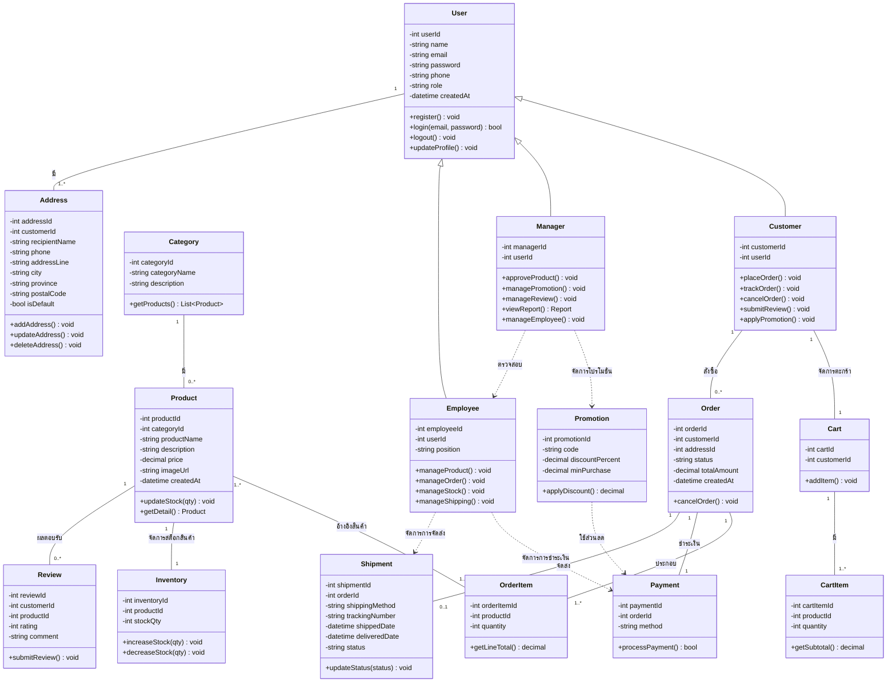

# 📐 Analysis & Design - Farmart

เอกสารวิเคราะห์และออกแบบระบบ (Analysis & Design) สำหรับโครงงาน
**ระบบจัดการร้านค้าจำหน่ายอุปกรณ์การเกษตร (Online Agricultural Equipment Store System)**

---

## 📋 สารบัญ

- [1. Use Case Diagram](#1-use-case-diagram)
- [2. รายละเอียด Use Case](#2-รายละเอียด-use-case)
- [3. Class Diagram](#3-class-diagram)
- [4. รายละเอียด Class](#4-รายละเอียด-class)
- [5. Wireframe](#5-wireframe)

---

## 1. Use Case Diagram

แสดงความสัมพันธ์ระหว่างผู้ใช้งาน (Actors) ทั้ง 3 กลุ่ม กับฟังก์ชันของระบบ ได้แก่ **ผู้ใช้งานทั่วไป, ลูกค้า, พนักงาน**

```mermaid
graph LR
    CustomerActor((ลูกค้า))
    EmployeeActor((พนักงาน))
    AdminActor((แอดมิน))


    %% ลูกค้า
    CustomerActor --> UC_Register[สมัครสมาชิก]
    CustomerActor --> UC_Login[เข้าสู่ระบบ]
    CustomerActor --> UC_Profile[จัดการข้อมูลส่วนตัว]
    UC_Profile -.include.-> UC_EditProfile[แก้ไขข้อมูลส่วนตัว]
    CustomerActor --> UC_Search [ค้นหาสินค้า]
    CustomerActor --> UC_Detail [ดูรายละเอียดสินค้า]
    CustomerActor --> UC_Cart[จัดการสินค้าในตะกร้า]
    UC_Cart -.include.-> UC_CartOps["เพิ่ม/ลบสินค้า, ดูสรุปยอดรวม"]
    CustomerActor --> UC_Order[สั่งซื้อสินค้า]
    UC_Order -.include.-> UC_Address[เลือกที่อยู่จัดส่ง]
    UC_Order -.include.-> UC_PayMethod[เลือกช่องทางชำระเงิน]
    CustomerActor --> UC_Track[ติดตามคำสั่งซื้อ]
    CustomerActor --> UC_Cancel[ยกเลิกคำสั่งซื้อ]
    UC_Cancel -.include.-> UC_ConfirmCancel[รับแจ้งเตือนยืนยันการยกเลิก]
    CustomerActor --> UC_Review["รีวิวสินค้า/ให้คะแนน"]

    %% พนักงาน
    EmployeeActor --> UC_ManageProduct[จัดการสินค้า]
    UC_ManageProduct -.include.-> UC_ProductOps["เพิ่ม/ลบ/แก้ไขสินค้า"]
    EmployeeActor --> UC_ManageOrder[จัดการคำสั่งซื้อ]
    UC_ManageOrder -.include.-> UC_OrderOps["ตรวจสอบ/ยืนยัน, อัปเดตสถานะ, ยกเลิกคำสั่งซื้อ"]
    EmployeeActor --> UC_ManageShip[จัดการการจัดส่ง]

    %% แอดมิน
    AdminActor --> UC_ManageCustomer[จัดการลูกค้า]
    AdminActor --> UC_ManageReview[จัดการรีวิว]
    AdminActor --> UC_Report["รายงาน/สถิติ"]
    AdminActor --> UC_Approve[อนุมัติการจัดการสินค้า]
    AdminActor --> UC_Product[เข้าถึงสินค้า]
```

---

## 2. รายละเอียด Use Case

| กลุ่มผู้ใช้ | Use Case | ความสัมพันธ์ |
|---|---|---|
| **ผู้ใช้งานทั่วไป** | เรียกดูหน้าแรก, ค้นหาสินค้า, ดูรายละเอียดสินค้า | เข้าดูได้โดยไม่ต้องล็อกอิน |
| **ลูกค้า** | สมัครสมาชิก | `<<include>>` ยืนยันตัวตน (อีเมล/มือถือ) |
| | เข้าสู่ระบบ | - |
| | จัดการข้อมูลส่วนตัว | `<<include>>` แก้ไขข้อมูลส่วนตัว |
| | จัดการสินค้าในตะกร้า | `<<include>>` เพิ่ม/ลบสินค้า, ดูสรุปยอดรวม |
| | สั่งซื้อสินค้า | `<<include>>` เลือกที่อยู่จัดส่ง / `<<extend>>` ดูโปรโมชั่นที่มีอยู่ |
| | ชำระเงิน | `<<include>>` เลือกช่องทางชำระเงิน |
| | ติดตามคำสั่งซื้อ | - |
| | ยกเลิกคำสั่งซื้อ | `<<include>>` รับแจ้งเตือนยืนยันการยกเลิก → รับข้อมูลการคืนเงินผ่านอีเมล |
| | รีวิวสินค้า/ให้คะแนน, ติดต่อสอบถาม | - |
| **พนักงาน** | จัดการสินค้า | `<<include>>` เพิ่ม/ลบ/แก้ไขสินค้า |
| | จัดหมวดหมู่สินค้า, จัดการเนื้อหาสินค้าในเว็บไซต์ | - |
| | จัดการคำสั่งซื้อ | `<<include>>` ตรวจสอบ/ยืนยัน, อัปเดตสถานะ, ยกเลิก / `<<extend>>` จัดการคืนเงิน |
| | จัดการการชำระเงิน, จัดการการจัดส่ง | - |
| **ผู้จัดการ** | จัดการลูกค้า, จัดการโปรโมชั่น/ส่วนลด, จัดการรีวิว, รายงาน/สถิติ, อนุมัติการจัดการสินค้า | - |

---

## 3. Class Diagram



---

## 4. รายละเอียด Class

| Class | หน้าที่หลัก | ความสัมพันธ์สำคัญ |
|---|---|---|
| **User** | Class แม่ (Base class) เก็บข้อมูลบัญชีผู้ใช้ทุกประเภท, มี register/login/logout/updateProfile | เป็น parent ของ Customer, Manager, Employee (Inheritance) และมี Address ได้หลายรายการ |
| **Address** | ที่อยู่จัดส่งของผู้ใช้ | เชื่อมกับ User (1 คนมีได้หลายที่อยู่) |
| **Customer** | ลูกค้าที่สั่งซื้อสินค้า | สั่งซื้อ (Order), มีตะกร้า (Cart), เขียนรีวิว (Review), ใช้โปรโมชั่น |
| **Cart / CartItem** | ตะกร้าสินค้าและรายการสินค้าในตะกร้า | Cart 1 ใบมีได้หลาย CartItem |
| **Category** | หมวดหมู่สินค้า | 1 หมวดหมู่มีได้หลายสินค้า |
| **Product** | ข้อมูลสินค้า | เชื่อมกับ Category, Inventory (สต็อก), OrderItem, Review |
| **Inventory** | จัดการสต็อกคงเหลือของสินค้าแต่ละชิ้น | 1 สินค้า ต่อ 1 Inventory |
| **Order / OrderItem** | คำสั่งซื้อและรายการสินค้าที่สั่ง | Order เชื่อมกับ Payment, Shipment, Customer |
| **Payment** | ข้อมูลการชำระเงินของคำสั่งซื้อ | 1 Order ต่อ 1 Payment |
| **Shipment** | ข้อมูลการจัดส่งสินค้า | 1 Order ต่อ 0-1 Shipment |
| **Review** | รีวิวและให้คะแนนสินค้า | เชื่อมกับ Customer และ Product |
| **Manager** | ผู้จัดการระบบ อนุมัติสินค้า, จัดการโปรโมชั่น/รีวิว, ดูรายงาน, จัดการพนักงาน | สืบทอดจาก User, ดูแล/ตรวจสอบ Employee |
| **Employee** | พนักงาน จัดการสินค้า คำสั่งซื้อ สต็อก และการจัดส่ง | สืบทอดจาก User, จัดการ Payment และ Shipment |
| **Promotion** | โค้ดส่วนลด/โปรโมชั่น | ใช้ร่วมกับ Payment ตอนคำนวณส่วนลด |

---

## 5. Wireframe

ออกแบบด้วย Figma และ Stitch AI โดยใช้โทนสีเขียว (สื่อถึงธีมการเกษตร) แบ่งเป็น 2 ส่วนหลัก

### 5.1 ฝั่งลูกค้า (Customer Frontend)

| หน้าจอ | องค์ประกอบหลัก |
|---|---|
| **หน้าแรก (Home)** | Banner โปรโมชัน, หมวดหมู่สินค้าแนะนำ, สินค้าขายดี |
| **หน้ารายการสินค้า (Product List)** | ตัวกรองหมวดหมู่/ราคา, ช่องค้นหา, การ์ดสินค้า (รูป, ชื่อ, ราคา) |
| **หน้ารายละเอียดสินค้า (Product Detail)** | รูปภาพสินค้า, คำอธิบาย, ราคา, ปุ่มเพิ่มลงตะกร้า |
| **หน้าตะกร้าสินค้า (Cart)** | รายการสินค้าที่เลือก, จำนวน, ยอดรวม, ปุ่มดำเนินการสั่งซื้อ |
| **หน้าชำระเงิน (Checkout)** | ที่อยู่จัดส่ง, ช่องทางชำระเงิน, สรุปยอดรวม |
| **หน้าประวัติคำสั่งซื้อ (Order History)** | รายการคำสั่งซื้อพร้อมสถานะ |

### 5.2 ฝั่งหลังบ้าน (Admin / Employee Dashboard)

| หน้าจอ | องค์ประกอบหลัก |
|---|---|
| **แดชบอร์ด (Dashboard)** | กราฟยอดขาย, สินค้าคงเหลือ, สินค้าขายดี |
| **จัดการสินค้า (Product Management)** | ตาราง CRUD สินค้า, อัปโหลดรูปภาพ, จัดหมวดหมู่ |
| **จัดการคำสั่งซื้อ (Order Management)** | ตารางคำสั่งซื้อ, เปลี่ยนสถานะ, พิมพ์ใบสั่งซื้อ |
| **จัดการผู้ใช้งาน (User Management)** | เพิ่ม/แก้ไข/ลบ user, กำหนดสิทธิ์การเข้าถึง |
| **รายงาน (Reports)** | ออกรายงานยอดขายรายวัน/เดือน, Export ข้อมูล |

> 📌 **หมายเหตุ:** ไฟล์ Wireframe ต้นฉบับจาก Figma/Stitch AI แนบเป็น Screenshot ประกอบเอกสารนี้ (ดูภาพประกอบในโฟลเดอร์ `docs/wireframe/`)
