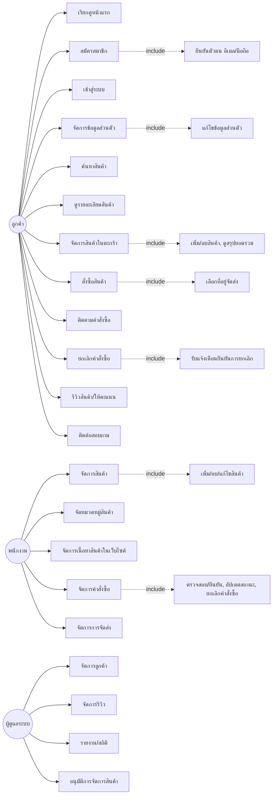
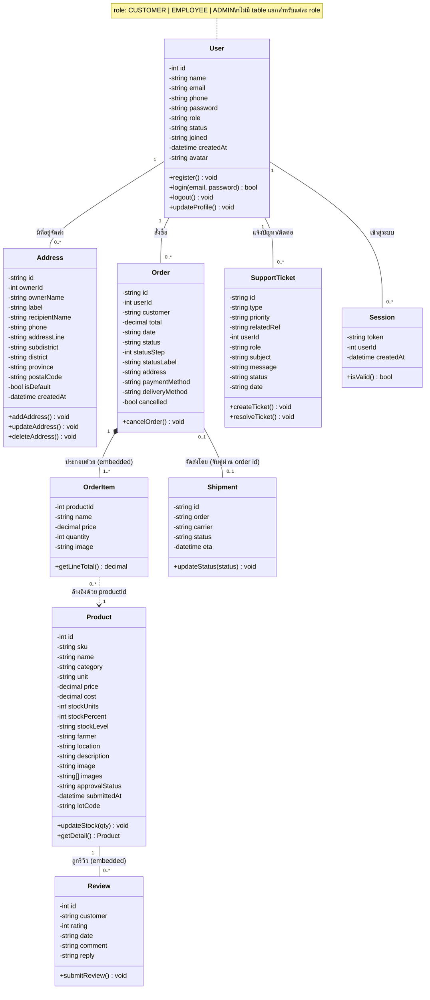

# 📐 Analysis & Design - Farmart

เอกสารวิเคราะห์และออกแบบระบบ (Analysis & Design) สำหรับโครงงาน
**ระบบจัดการร้านค้าจำหน่ายอุปกรณ์การเกษตร (Online Agricultural Equipment Store System)**

---

## 📋 สารบัญ

- [1. Use Case Diagram](#1-use-case-diagram)
- [2. รายละเอียด Use Case](#2-รายละเอียด-use-case)
- [3. Class Diagram](#3-class-diagram)
- [4. รายละเอียด Class](#4-รายละเอียด-class)
- [5. Wireframe](#5-wireframe)

---

## 1. Use Case Diagram

แสดงความสัมพันธ์ระหว่างผู้ใช้งาน (Actors) ทั้ง 3 กลุ่ม กับฟังก์ชันของระบบ ได้แก่ **ลูกค้า, พนักงาน, ผู้ดูแลระบบ** (ระบบไม่มี role ผู้ใช้งานทั่วไปที่ไม่ล็อกอิน)

---

## 2. รายละเอียด Use Case

| กลุ่มผู้ใช้ | Use Case | ความสัมพันธ์ |
|---|---|---|
| **ลูกค้า** | เรียกดูหน้าแรก, ค้นหาสินค้า, ดูรายละเอียดสินค้า | - |
| | สมัครสมาชิก | `<<include>>` ยืนยันตัวตน (อีเมล/มือถือ) |
| | เข้าสู่ระบบ | - |
| | จัดการข้อมูลส่วนตัว | `<<include>>` แก้ไขข้อมูลส่วนตัว |
| | จัดการสินค้าในตะกร้า | `<<include>>` เพิ่ม/ลบสินค้า, ดูสรุปยอดรวม |
| | สั่งซื้อสินค้า | `<<include>>` เลือกที่อยู่จัดส่ง |
| | ติดตามคำสั่งซื้อ | - |
| | ยกเลิกคำสั่งซื้อ | `<<include>>` รับแจ้งเตือนยืนยันการยกเลิก |
| | รีวิวสินค้า/ให้คะแนน, ติดต่อสอบถาม | - |
| **พนักงาน** | จัดการสินค้า | `<<include>>` เพิ่ม/ลบ/แก้ไขสินค้า |
| | จัดหมวดหมู่สินค้า, จัดการเนื้อหาสินค้าในเว็บไซต์ | - |
| | จัดการคำสั่งซื้อ | `<<include>>` ตรวจสอบ/ยืนยัน, อัปเดตสถานะ, ยกเลิก |
| | จัดการการจัดส่ง | - |
| **ผู้ดูแลระบบ (Admin)** | จัดการลูกค้า, จัดการรีวิว, รายงาน/สถิติ, อนุมัติการจัดการสินค้า | - |

---

## 3. Class Diagram

---

## 4. รายละเอียด Class

| Class | หน้าที่หลัก | ความสัมพันธ์สำคัญ |
|---|---|---|
| **User** | เก็บข้อมูลบัญชีผู้ใช้ทุกประเภทในตารางเดียว แยกสิทธิ์ด้วย field `role` (`CUSTOMER` / `EMPLOYEE` / `ADMIN`) แทนการแยก class ย่อย | มี Address, Order, SupportTicket, Session ได้หลายรายการ |
| **Address** | ที่อยู่จัดส่งของผู้ใช้ (อ้างอิงเจ้าของด้วย `ownerId`) | เชื่อมกับ User (1 คนมีได้หลายที่อยู่, ตั้งค่า `isDefault` ได้) |
| **Product** | ข้อมูลสินค้า รวมสต็อก (`stockUnits`/`stockLevel`) และสถานะอนุมัติไว้ในตัวเอง | มี Review แบบ embedded อยู่ในตัวสินค้าโดยตรง (ไม่มี Inventory table แยก) |
| **Review** | รีวิวและให้คะแนนสินค้า | **embedded อยู่ใน Product** (array `reviews[]`) ไม่ใช่ตารางแยกที่มี FK มาเชื่อม |
| **Order** | คำสั่งซื้อ เก็บชื่อ/ที่อยู่ลูกค้า วิธีชำระเงิน และสถานะไว้ในตัวเอง | อ้างอิง User ด้วย `userId`, มี OrderItem แบบ embedded, จับคู่กับ Shipment ผ่าน order id |
| **OrderItem** | รายการสินค้าที่สั่งในแต่ละ Order | **embedded อยู่ใน Order** (array `items[]`), อ้างอิง Product ด้วย `productId` แบบหลวมๆ (ไม่มี FK บังคับ) |
| **Shipment** | ข้อมูลการจัดส่งสินค้า | เชื่อมกับ Order ผ่าน field `order` (string เก็บ order id) ไม่ใช่ FK เชิงตัวเลข |
| **SupportTicket** | เรื่องร้องเรียน/แจ้งปัญหาจากผู้ใช้ (`support.json`) | อ้างอิง User ด้วย `userId` และอาจอ้างอิง Order ผ่าน `relatedRef` |
| **Session** | เซสชันการเข้าสู่ระบบ (token → userId) | อ้างอิง User ด้วย `userId`, ไม่มี expiry field ในข้อมูลปัจจุบัน |

---

## 5. Wireframe

ออกแบบด้วย Figma และ Stitch AI โดยใช้โทนสีเขียว (สื่อถึงธีมการเกษตร) แบ่งเป็น 2 ส่วนหลัก

### 5.1 ฝั่งลูกค้า (Customer Frontend)

| หน้าจอ | องค์ประกอบหลัก |
|---|---|
| **หน้าแรก (Home)** | Banner โปรโมชัน, หมวดหมู่สินค้าแนะนำ, สินค้าขายดี |
| **หน้ารายการสินค้า (Product List)** | ตัวกรองหมวดหมู่/ราคา, ช่องค้นหา, การ์ดสินค้า (รูป, ชื่อ, ราคา) |
| **หน้ารายละเอียดสินค้า (Product Detail)** | รูปภาพสินค้า, คำอธิบาย, ราคา, ปุ่มเพิ่มลงตะกร้า |
| **หน้าตะกร้าสินค้า (Cart)** | รายการสินค้าที่เลือก, จำนวน, ยอดรวม, ปุ่มดำเนินการสั่งซื้อ |
| **หน้าชำระเงิน (Checkout)** | ที่อยู่จัดส่ง, ช่องทางชำระเงิน, สรุปยอดรวม |
| **หน้าประวัติคำสั่งซื้อ (Order History)** | รายการคำสั่งซื้อพร้อมสถานะ |

### 5.2 ฝั่งหลังบ้าน (Admin / Employee Dashboard)

| หน้าจอ | องค์ประกอบหลัก |
|---|---|
| **แดชบอร์ด (Dashboard)** | กราฟยอดขาย, สินค้าคงเหลือ, สินค้าขายดี |
| **จัดการสินค้า (Product Management)** | ตาราง CRUD สินค้า, อัปโหลดรูปภาพ, จัดหมวดหมู่ |
| **จัดการคำสั่งซื้อ (Order Management)** | ตารางคำสั่งซื้อ, เปลี่ยนสถานะ, พิมพ์ใบสั่งซื้อ |
| **จัดการผู้ใช้งาน (User Management)** | เพิ่ม/แก้ไข/ลบ user, กำหนดสิทธิ์การเข้าถึง |
| **รายงาน (Reports)** | ออกรายงานยอดขายรายวัน/เดือน, Export ข้อมูล |

> 📌 **หมายเหตุ:** ไฟล์ Wireframe ต้นฉบับจาก Figma/Stitch AI แนบเป็น Screenshot ประกอบเอกสารนี้ (ดูภาพประกอบในโฟลเดอร์ `docs/wireframe/`)