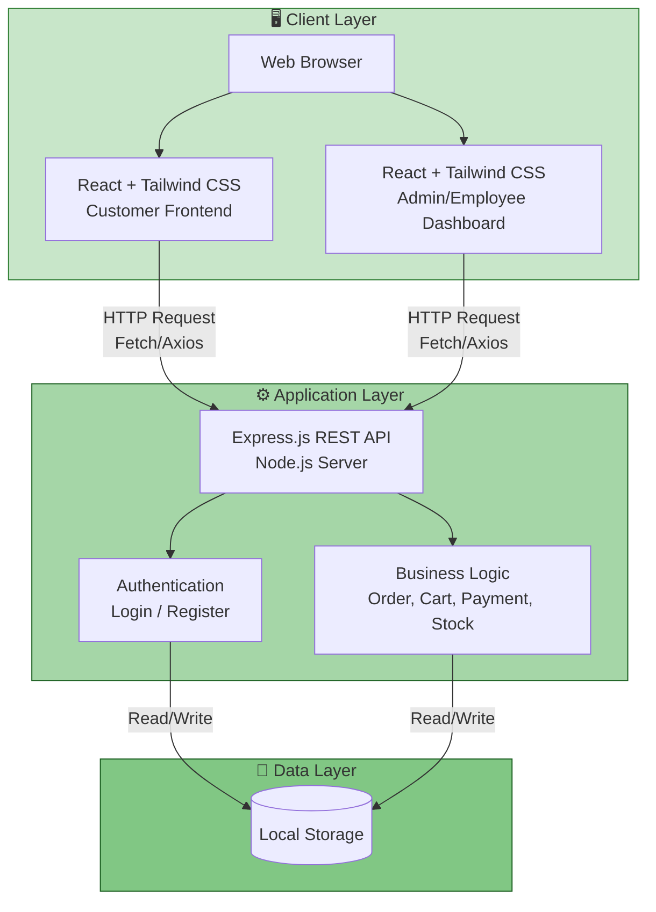
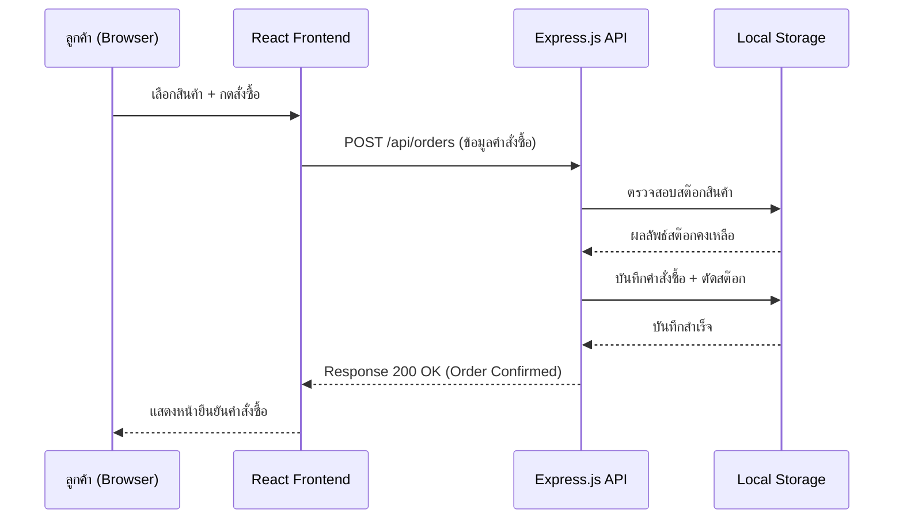

# 🏗️ System Architecture - Farmart

เอกสารสถาปัตยกรรมระบบ (System Architecture) สำหรับโครงงาน
**ระบบจัดการร้านค้าจำหน่ายอุปกรณ์การเกษตร (Online Agricultural Equipment Store System)**

---

## 📋 ภาพรวมสถาปัตยกรรม

ระบบออกแบบเป็นแบบ **3-Tier Architecture** ประกอบด้วย 3 ชั้นหลัก:

1. **Client Layer** — ส่วนติดต่อผู้ใช้งาน พัฒนาด้วย React + Tailwind CSS
2. **Application Layer** — ส่วนประมวลผลตรรกะทางธุรกิจ พัฒนาด้วย Node.js + Express.js
3. **Data Layer** — ส่วนจัดเก็บข้อมูล ใช้ **Local Storage** ตามที่ระบุในฟอร์มขออนุมัติโครงงาน

---

## 🗺️ Architecture Diagram

---

## 🔍 รายละเอียดแต่ละ Layer

### 1. Client Layer (ชั้นแสดงผล)

| องค์ประกอบ | รายละเอียด |
|---|---|
| **Customer Frontend** | หน้าเว็บสำหรับลูกค้า — เรียกดูสินค้า, ตะกร้า, สั่งซื้อ, ชำระเงิน, ติดตามคำสั่งซื้อ |
| **Admin/Employee Dashboard** | หน้าเว็บสำหรับพนักงาน/ผู้จัดการ — จัดการสินค้า, สต๊อก, คำสั่งซื้อ, รายงาน |
| **เทคโนโลยี** | React.js (Component-based UI), Tailwind CSS (Styling) |
| **การสื่อสาร** | ส่ง HTTP Request ไปยัง Backend ผ่าน Fetch API หรือ Axios ในรูปแบบ JSON |

### 2. Application Layer (ชั้นประมวลผล)

| องค์ประกอบ | รายละเอียด |
|---|---|
| **Express.js REST API** | จุดรับ-ส่งข้อมูลระหว่าง Client กับ Data Layer ผ่าน RESTful Endpoints |
| **Authentication** | จัดการล็อกอิน/สมัครสมาชิก/ยืนยันตัวตนของ User (Customer, Employee, Manager) |
| **Business Logic** | ประมวลผลตรรกะหลัก เช่น คำนวณราคา, จัดการตะกร้า, ตัดสต๊อกสินค้า, สร้างคำสั่งซื้อ |
| **เทคโนโลยี** | Node.js (Runtime), Express.js (Web Framework) |

### 3. Data Layer (ชั้นจัดเก็บข้อมูล)

| องค์ประกอบ | รายละเอียด |
|---|---|
| **Local Storage** | จัดเก็บข้อมูลสินค้า, ผู้ใช้, คำสั่งซื้อ, ตะกร้า ฯลฯ ในรูปแบบไฟล์/หน่วยความจำฝั่งเซิร์ฟเวอร์ |
| **เหตุผลที่เลือกใช้** | เหมาะกับขอบเขตโครงงานระดับการศึกษา ไม่ต้องติดตั้ง Database Server แยกต่างหาก ลดความซับซ้อนในการ Deploy |

---

## 🔄 Data Flow (ตัวอย่างการทำงาน: ลูกค้าสั่งซื้อสินค้า)

---

## ⚠️ ข้อจำกัดของสถาปัตยกรรมนี้

| ข้อจำกัด | คำอธิบาย |
|---|---|
| **การขยายระบบ (Scalability)** | Local Storage เหมาะกับการใช้งานขนาดเล็ก ไม่รองรับผู้ใช้งานพร้อมกันจำนวนมาก |
| **ความคงทนของข้อมูล (Persistence)** | ข้อมูลอาจสูญหายหากไฟล์ storage เสียหายหรือ deploy ใหม่โดยไม่ backup |
| **แนวทางพัฒนาต่อในอนาคต** | หากต้องการนำไปใช้งานจริง ควรอัปเกรดเป็นฐานข้อมูลจริง เช่น MongoDB หรือ PostgreSQL ตามที่ระบุใน README (Maintenance Phase ของ SDLC) |

---

## 🔗 เอกสารที่เกี่ยวข้อง

- [README.md](./README.md) — ภาพรวมโครงงานและ SDLC
- [analysis-design.md](./analysis-design.md) — Use Case Diagram และ Class Diagram